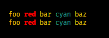

# iro

Fast and clean terminal coloring and styling utility for Deno and Node.js.

## Overview

- No dependencies
- Clean and easy syntax
- No polyfilling
- Lightweight
- Import only what you need

## Usage

### Deno

```ts
// hello.ts
import iro, { bold, red } from 'https://deno.land/x/iro/mod.ts';

console.log(iro('Hello, World!', bold, red));
```

### Node.js

**Install using npm:**

```sh
npm i node-iro
```

**...or Yarn:**

```sh
yarn add node-iro
```

**Use it:**

```js
// hello.js
const iro = require('node-iro').default;
const { bold, red } = require('node-iro');

console.log(iro('Hello, World!', bold, red));
```


## Advanced Usage

### Nesting

```js
// example taken from https://github.com/lukeed/kleur#nested-methods :)
console.log(iro(`foo ${iro('red', red, bold)} bar ${iro('cyan', cyan)} baz`, yellow));
console.log(iro('foo ' + iro('red', red, bold) + ' bar ' + iro('cyan', cyan) + ' baz', yellow));
```



## Supported Formatting

**Modifiers:** reset, bold, dim, italic, underline, inverse, hidden, strikethrough<br>
**Colors:** black, red, green, yellow, blue, magenta, cyan, white, gray, grey<br>
**Background colors:** bgBlack, bgRed, bgGreen, bgYellow, bgBlue, bgMagenta, bgCyan, bgWhite

*Note: `italic` and `strikethrough` are not widely supported.*

*Note: iro supports [`NO_COLOR`](https://no-color.org/) both on Deno and Node.js.*

## Credits

This project is heavily inspired by [kleur](https://github.com/lukeed/kleur). It was mainly made to be used in Deno, but I've decided to release it for Node.js users too. The syntax is different for two reasons: personal preference and lean typings. If you use Node.js and prefer kleur's syntax, you should definitely choose kleur over iro, it's an awesome library 😊

## Planned Features

- Unit tests

## License

MIT.
